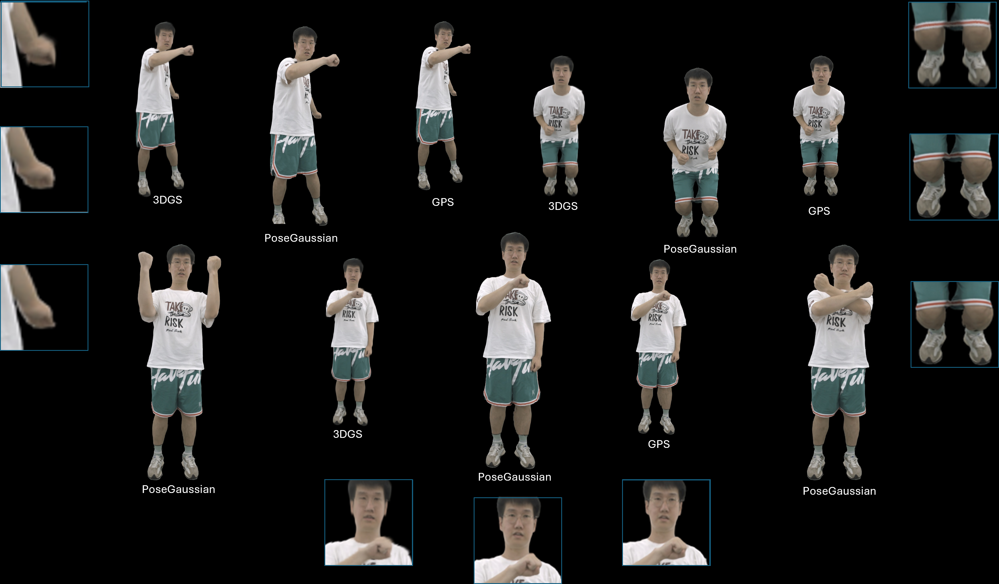

# PoseGaussian

## Demo Video

****
#linux=22.04.5
#python=3.10.13
#cuda=11.8

#Train on THuman2.0

conda env create --file environment.yml

conda activate PoseGaussian

git clone https://github.com/graphdeco-inria/gaussian-splatting --recursive

cd gaussian-splatting/

pip install -e submodules/diff-gaussian-rasterization

cd ..

git clone https://github.com/princeton-vl/RAFT-Stereo.git

cd RAFT-Stereo/sampler

python setup.py install

cd ../..

git clone https://github.com/open-mmlab/mmpose.git

cd mmpose

#More detailed Installation steps in https://mmpose.readthedocs.io/en/latest/installation.html

conda create --name openmmlab python=3.8 -y

conda activate openmmlab

conda install pytorch torchvision -c pytorch

pip install -U openmim

mim install mmengine

mim install "mmcv>=2.0.1"

mim install "mmdet>=3.1.0"

git clone https://github.com/open-mmlab/mmpose.git

cd mmpose

pip install -r requirements.txt

pip install -v -e .

mim install "mmdet>=3.1.0"

mim download mmpose --config td-hm_hrnet-w48_8xb32-210e_coco-256x192  --dest .

cp "PATH TO ROOT FOLDER/heatmap.py" .

# Download render_data and real_data from URL below extract the data in PoseGaussian folder

# give the train/img and val/img path for render_data and train path for generating heatmap folder
python heatmap.py

#Note: The data path of heatmap will be same as img folder in train and val

cd ..

conda deactivate

#For training

python trainer.py

#For testing
python test.py \
--test_data_root 'real_data' \
--ckpt_path 'PATH/TO/PoseGaussian_pose.pth' \
--src_view 0 1 \
--ratio=0.5
